# DevOps Playground: Self-Healing Microservices & Chaos Simulator

Welcome to the **DevOps Playground**! This project is a complete, local-first DevOps portfolio demonstration showcasing modern software engineering and operations best practices. 

It implements a multi-tier microservices application running inside Docker, completely provisioned using **Infrastructure as Code (IaC)** with **Terraform**, observed via a **Prometheus & Grafana** metrics stack, and integrated with **GitHub Actions** CI/CD pipelines.

To make the infrastructure tangible and interactive, the project includes a custom **Chaos Engineering Control Panel** where you can inject simulated failures (latency, memory leaks, high CPU) or kill processes entirely, and watch the infrastructure dynamically self-heal in real-time.

---

## 🛠️ Tech Stack & Architecture

```mermaid
graph TD
    User([User Browser]) -->|HTTP Port 3000| Frontend[React Frontend Nginx]
    User -->|HTTP Port 3001| Grafana[Grafana Dashboard]
    
    Frontend -->|API Requests Port 5000| Gateway[Node.js API Gateway]
    
    Gateway -->|DB Queries Port 5432| DB[(PostgreSQL Database)]
    Worker[Python Task Worker] -->|Polls DB| DB
    
    Prometheus[Prometheus Server] -->|Scrapes Metrics| Gateway
    Prometheus -->|Scrapes Metrics| Worker
    Prometheus -->|Scrapes Metrics| cAdvisor[Google cAdvisor]
    
    cAdvisor -->|Inspects Resource Usage| DockerDaemon[Host Docker Socket]
    Grafana -->|Queries Metrics| Prometheus
    
    style Frontend fill:#1e293b,stroke:#06b6d4,stroke-width:2px;
    style Gateway fill:#1e293b,stroke:#06b6d4,stroke-width:2px;
    style Worker fill:#1e293b,stroke:#8b5cf6,stroke-width:2px;
    style DB fill:#1e293b,stroke:#10b981,stroke-width:2px;
    style Prometheus fill:#1e293b,stroke:#f59e0b,stroke-width:2px;
    style Grafana fill:#1e293b,stroke:#f59e0b,stroke-width:2px;
    style cAdvisor fill:#1e293b,stroke:#9ca3af,stroke-width:2px;
```



### Infrastructure & Operations
*   **Infrastructure as Code (IaC):** Terraform (with the official Docker provider) manages the networks, volumes, environment variables, healthchecks, and lifecycles of all containers.
*   **Observability Stack:** 
    *   **Prometheus** scrapes application-level indicators from Node.js (request volume, error rates, response latency histograms) and Python, plus container-level resource statistics from cAdvisor.
    *   **Grafana** is pre-configured to provision the Prometheus data source and load a full monitoring dashboard instantly upon startup.
    *   **cAdvisor** provides raw container performance profiles (CPU/Memory usage percentage).
*   **Continuous Integration (CI/CD):** A GitHub Actions workflow automates security auditing, Python code linting (`flake8`), package vulnerability checks (`npm audit`), local Docker image build validation, and image security vulnerability scans using **Trivy**.

### Core Services
*   **React Frontend (Port 3000):** A glassmorphic dashboard built using Vite, styled with custom Vanilla CSS, and packed with Lucide Icons. It displays system status, runs a real-time event logs console, acts as a database task client, and exposes chaos trigger controls.
*   **Node.js API Gateway (Port 5000):** Express server serving client requests, writing/reading database tasks, proxying worker actions, and exporting custom Prometheus client metrics.
*   **Python Worker Service (Port 5001):** Flask application running an independent background thread. It polls PostgreSQL for pending tasks, simulates processing (updating states to completed), and measures work metrics.
*   **Database (Port 5432):** PostgreSQL 16 Alpine container, seeded automatically via Terraform mounted scripts.

---

## ⚡ Chaos Experiments & Self-Healing Scenarios

You can verify and demonstrate the following DevOps concepts directly inside the playground:

1.  **Process Auto-Restart (Self-Healing):**
    *   *Action:* Click **"Crash API Gateway Container"** or **"Crash Worker Service"** on the dashboard.
    *   *DevOps Mechanism:* The Node/Python process exits with status code `1`. Because the Terraform configuration specifies `restart = "always"`, the Docker daemon detects the crash and immediately boots up a fresh container instance.
    *   *Observation:* Watch the frontend console warn that the service went offline, and then log recovery just a few seconds later without any manual human intervention.
2.  **Memory Leak & Out-of-Memory (OOM) Kill Recovery:**
    *   *Action:* Toggle the **"Memory Leak (Gateway)"** switch.
    *   *DevOps Mechanism:* The gateway starts appending 5MB strings to an array every 100ms. 
    *   *Observation:* Watch the Gateway RSS memory rise on the dashboard. In Grafana, the memory graph spikes. Once it exceeds host-available limits (or Docker OOM thresholds), the Docker daemon kills the container. The restart policy is triggered, restarting the service.
3.  **Real-Time Latency Degradation:**
    *   *Action:* Toggle the **"Inject Latency (Gateway)"** switch.
    *   *Observation:* Open Grafana and look at the **"API Gateway Response Latency"** panel. Watch the request latency line spike from milliseconds to a flat 2.0 seconds. Toggle it off to watch the graph recover.
4.  **CPU Spike Monitoring:**
    *   *Action:* Toggle the **"Worker CPU Spike"** switch.
    *   *Observation:* Watch the **"Container CPU Usage"** graph in Grafana. The worker service line will climb to consume an entire CPU core.

---

## 🚀 Getting Started (Run Locally)

### Prerequisites
Make sure you have the following installed on your machine:
*   [Docker Desktop](https://www.docker.com/products/docker-desktop/) (must be running)
*   [Terraform](https://developer.hashicorp.com/terraform/downloads) (installed and added to PATH)
*   PowerShell (standard on Windows)

### Running the Project

1.  Open your terminal inside the project root (`devops-playground`).
2.  Run the PowerShell start script to build all services and launch the infrastructure:
    ```powershell
    .\run.ps1
    ```
3.  Once the script finishes, visit the services at the URLs below:
    *   **Control Center Dashboard:** [http://localhost:3000](http://localhost:3000)
    *   **Grafana Dashboards:** [http://localhost:3001](http://localhost:3001)
    *   **Prometheus Console:** [http://localhost:9090](http://localhost:9090)
    *   **cAdvisor Metrics:** [http://localhost:8088](http://localhost:8088)
    *   **API Gateway Status JSON:** [http://localhost:5000/api/status](http://localhost:5000/api/status)

### Stopping/Tearing Down the Infrastructure
To clean up all Docker containers, networks, volumes, and Terraform states, run:
```powershell
.\run.ps1 -Destroy
```
